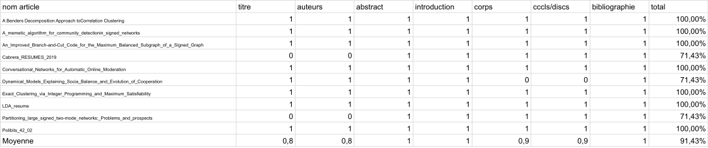

# Abstract

Dans le cadre de la formation de License du CERI situé à Avignon, il a été demandé, lors des travaux pratiques du module de génie logiciel, de développer un outil d'extraction de données basé sur pdftotext, un outil de conversion de fichiers PDF en fichiers textes. \
L'objectif de ce projet est plutôt la mise en pratique du cours que le développement en lui-même, en mettant en place la méthodologie de travail appelée SCRUM. \
Nous verrons au travers de ce rapport la méthode de travail mise en place, les résultats obtenus et les difficultés rencontrées. \ 

# Méthode

## Environnement de développement

Pour travailler dans meilleures conditions et développer efficacement, nous avons choisi de développer notre outil en Python, pour sa facilité d'utilisation et sa grande polyvalence. \
Nous avons également choisi d'utiliser Github pour la gestion de version. \ 
Pour la rédaction de ce rapport, nous avons utilisé le langage de balisage Markdown, ensuite converti en lateX puis en PDF grâce à l'outil Pandoc [@pandoc] qui est un langage de balisage léger, facile à utiliser et qui permet de générer des documents de qualité. \

## L'outil pdftotext

Pdftotext est un outil de conversion de fichiers PDF en fichiers textes disponible sur la plupart des systèmes d'exploitation. Il est possible de l'utiliser en ligne de commande ou en tant que bibliothèque, et dispose d'une variété d'options qui le rendent très polyvalent. \
Afin de pouvoir extraire les données des fichiers PDF à traiter, nous avons ainsi utilisé pdftotext pour convertir les fichiers PDF en fichiers textes, afin d'ensuite en extraite les données intéressantes. \

## Notre outil

Notre outil, appelé sobrement la "MOAI" (pour Machine à Obtentir Admirablement des Informations), lorsqu'il est lancé, prend comme paramètres les options suivantes :

  + -t (--txt) ou -x (--xml) ou --xmlplus, qui permet de spécifier le format de sortie, avec respectivement une sortie texte, une sortie XML ou une sortie XML avec des balises supplémentaires  
  + Le chemin vers le dossier contenant les fichiers PDF à traiter 

La MOAI demande alors à l'utilisateur quels sont les fichiers PDF à traiter dans le dossier spécifié, en lui demandant d'entrer le numéro de chaque fichier à traiter, séparés par des espaces. \
Une fois les fichiers sélectionnés, la MOAI convertit les fichier PDF en fichiers textes temporaires grâce à pdftotext, puis récupère les données dont nous avons besoin, soit le nom du fichier d'origine, le titre de l'article, les auteurs, le résumé de l'article, et la bibliographie de l'article. Dans le cas de l'utilisation --xml-plus, la MOAI récupère également l'introduction, le corps, la conclusion et la discussion de l'article. \
Les fichiers de sortie sont ensuite stockées dans un dossier nommé de la même manière que le dossier d'entrée, mais accompagné du suffixe "_XML" ou "_TXT" selon le format choisi. \
La MOAI supprime finalemet les fichiers temporaires créés. \

# Résultats

## Méthode de calcul des résultats

Afin d'évaluer les performances de la MOAI, nous avons procédé de la manière suivante : \
Nous avons tout d'abord converti le corpus de test au format xml en utilisant l'option --xmlplus, afin de parser toutes les sections des fichiers d'entrée. Ensuite, nous avons comparé chaque fichier d'entrée avec son fichier de sortie, et avons reporté dans un tableau, pour chaque section que la MOAI devait parser, si les sections étaient bien délimitées. Si la section est correctement délimitée, la case du tableau vaut 1, sinon elle vaut zéro. \
Nous avons ensuite effectué un calcul de l'efficacité de la MOAI en calculant le ratio **sections trouvées par la MOAI / nombre de sections total**, et l'avons converti en pourcentage pour un résultat plus lisible. \
Nous avons enfin effectué une moyenne du parsing de chaque section ainsi que de l'efficacité de parsing de la MOAI. Nous avons ainsi obtenu les résultats suivants :

## Analyse des résultats

Nous pouvons voir qu'à part pour trois fichiers, toutes les sections sont parsées correctement. En effet, ces trois fichiers présentent des disparités de mise en page élevées par rapport au corpus que nous avons utilisé pour le développement de la MOAI. \
Les fichiers *Cabrera_RESUMES_2019* 
et *Partitioning_large_signed_two-mode_networks_Problems_and_prospects* possèdent un agencemenent particulier des informations sur la première page, et notamment des en-têtes de page, ce qui pour notre algorithme fausse la récupération du titre et des auteurs. \ 
Également, le fichier *Dynamical_Models_Explaining_Socia_Balance_and_Evolution_of_Cooperation* ne contient pas de numéro de section dans ses titres de sections, dont nous nous servons pour baser notre séparation des différentes parties.

# Conclusion

Grâce aux résultats obtenus, nous pouvons dire que la MOAI convertit assez bien les fichiers d'entrée qui lui sont présentés, avec en moyenne 91,43% des sections parsées correctement, au vu du temps de développement qui lui a été consacré. \
Bien sûr, l'outil n'est pas parfait, et ne parvient pas à détecter certaines parties du texte, notamment quand ces dernières ne sont pas délimitée par des mots-clé. \
Cette approximation est en partie dûe à l'utilisation de pdftotext, qui s'il permet rapidement d'accéder aux contenus des articles, fait perdre toutes les informations sur le formatage du texte d'origine (mots en gras, italique, sauts de plusieurs lignes, etc...), qui auraient pu être utiles pour la détection des différentes parties, comme du titre de l'article et de la liste des auteurs notamment. Également, l'échantillon de documents de départ n'était pas assez diversfié par rapport au corpus de test pour que nous puissions développer une solution vraiment universelle. \
Il aurait peut-être été plus long, mais plus gratifiant, de devoir décrypter le fichier PDF nous-même, afin de pouvoir en extraire toutes les informations sémantiques de mise en page. \

# Bibliographie
